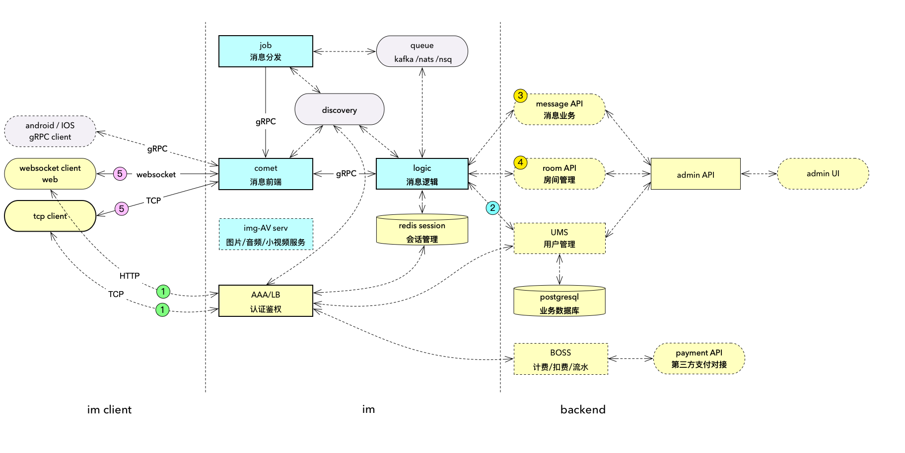

# Design docs
docs for requirement / architecture / detail design / guide 

## 0. Naming 命名

临时命名为 tsingchat 轻扯
> 扯 
>
> 撦 
>
> chě 
>
>【动】 
>
> (形声。从手,奢声。扯是“撦”的俗字。本义:撕裂) 
>
> 谈话,多指漫无边际的谈话〖chat;gossip〗。如:闲扯;扯家常;东拉西扯;扯个没完;扯蛋(胡扯) 

一个轻型快速的 IM ( instance messaging) 即时消息中间件, 

提供通用的开发接口及客户端SDK-- JS / java ( or Kotlin)  ,  核心为golang 开发, 终端与后台管理由  java / nodeJS 开发

## 1. Goal 目标

### 1.1 开发目标

1. 视频业务平台的即时消息服务, 支持弹幕/单聊/群聊/直播聊天
1. 通用即时消息, 支持消息处理 API ( 聊天机器人与敏感词过滤 ) 
1. 支持即时消息类型
    1. 文本消息
    2. 代金消费(送代金币)
    3. 表情图案
    4. 音频 (规划中)
    5. 视频 (规划中)
1. 支持按用户数计费, 按消息数计费,按代金消费抽成
2. 客户端支持
    1. 优先支持 android APK 集成, 提供中间件集成
    2. 支持 web 端进行用户注册/验证/下载 android apk 
    3. 支持 web 端用户自服务, 取回登录激活码, 充值( 优先支持 paypal ), 查消费流水
    4. 支付 web 端客服
3. 用户与硬件绑定/解绑, 即 android APK 与手机/机顶盒绑定

### 1.2 性能/部署/运维要求
1. 部署简单,  ftp upload and run 
2. 配置简单, 配置文件或单一配置中心
3. 快速扩容, 快速迁移,快速备份与恢复
4. 收费服务能快速 fail-over 

## 2. Archuricture 架构

基础架构如上图

## 3. 借鉴与致敬

本软件 IM 部分的网元架构与通讯模式借鉴 [goim](https://goim.io), 在此向 [毛剑](https://github.com/Terry-Mao) 表示诚挚感谢.

1. IM 部分模型借鉴  [goim](https://goim.io) , 内部通讯变更为 gRPC + flatbuffers 
2. TCP 部分借鉴 [kcp-go](https://github.com/xtaci/kcp-go) 与 [smux](https://github.com/xtaci/smux) , 感谢 [xtaci](https://github.com/xtaci) 

## 4. 

## 4. copyright 
版权归属 tsingchat 小组所有

本软件中采用其他开源软件, 版权归各自开发者所有

tsingchat 授权方式稍后确定.
